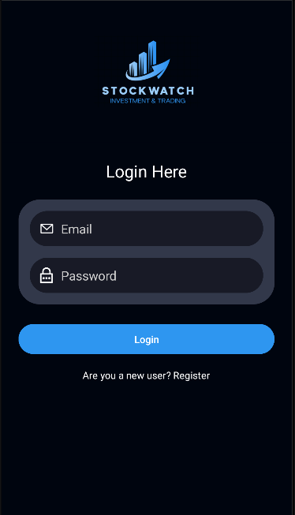
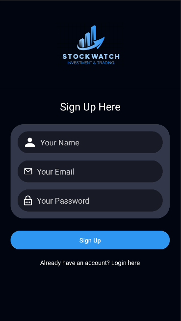
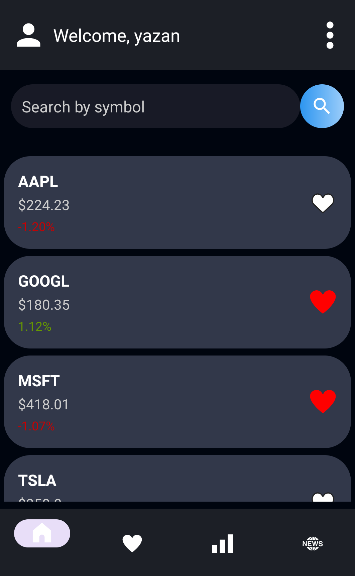
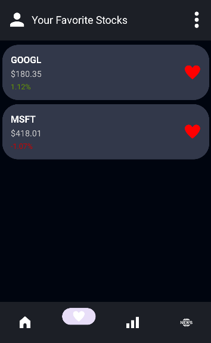
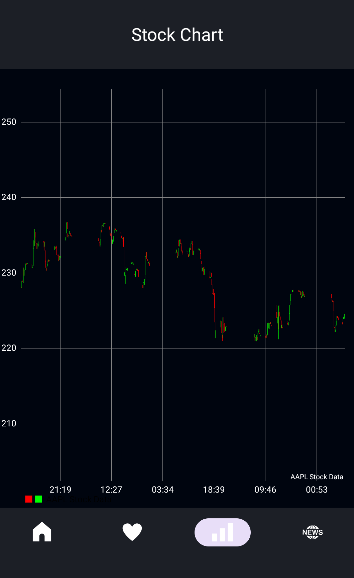

# StockWatchApp

StockWatchApp is a comprehensive application for monitoring stock prices, viewing charts, and managing a virtual stock portfolio. This app is built with Android and integrates Firebase for user authentication and database management.

---

## Features

- **User Authentication**: Sign up and login securely with Firebase Authentication.
- **Favorite Stocks**: Add stocks to your favorites list for quick access. Favorites are saved in Firebase Realtime Database.
- **Stock Price Tracking**: View real-time stock prices fetched from Yahoo Finance API.
- **Stock Charts**: Access historical price charts for each stock to analyze performance over time.
- **Financial News**: Stay updated with the latest news related to the stock market.

---

## Screenshots

### Login Screen


### Signup Screen


### Home Screen


### Favorites Screen


### Chart Screen


### News Feed


---

## Usage

1. **User Authentication**:
   - Users can sign up or log in to access their account. Firebase Authentication is used to manage user sessions securely.

2. **Favorite Stocks**:
   - Add stocks to your favorites list by tapping the favorite icon next to a stock. The list is saved to Firebase, so it’s available across sessions.

3. **Stock Charts**:
   - Tap on a stock to view its historical price chart. This feature helps users analyze stock trends over time.

4. **News Feed**:
   - Get the latest stock market news directly in the app. Each news article is fetched in real time, allowing users to stay informed.

---

## Configuration

### Firebase Setup

1. Go to the [Firebase Console](https://console.firebase.google.com/).
2. Create a new Firebase project.
3. Enable **Firebase Authentication** (Email/Password), **Realtime Database**.
4. Download the `google-services.json` file and place it in the `app` directory of your Android project.

### API Key Setup

1. Obtain an API key from [Yahoo Finance API on RapidAPI](https://rapidapi.com/apidojo/api/yahoo-finance1/).
2. Replace the placeholder in `MainActivity.kt` with your actual API key:
   ```kotlin
   private val apiKey = "API_KEY"
